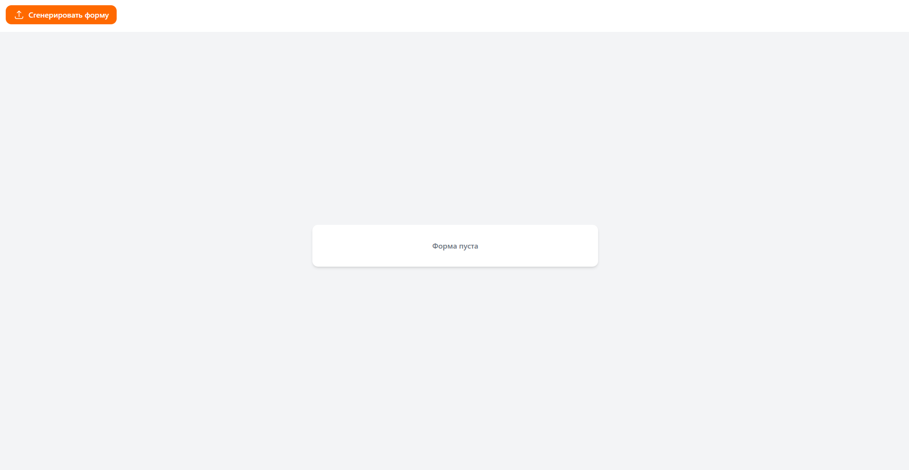
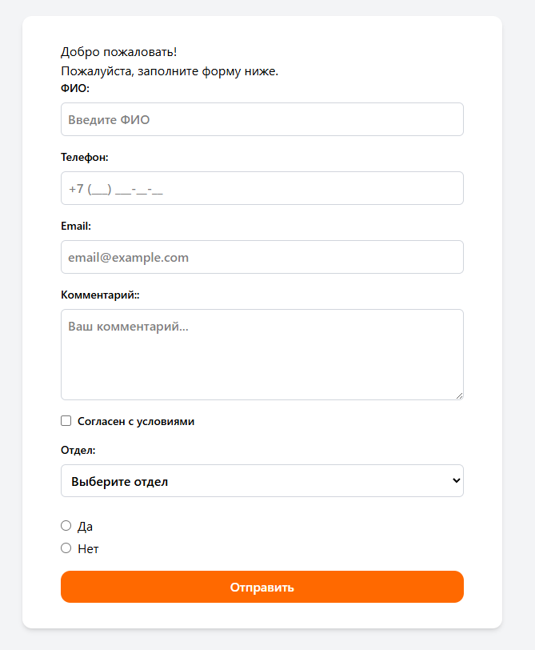

# Веб-приложение для генерации форм из JSON

Это веб-приложение на Vite + React, которое позволяет пользователю генерировать формы на основе данных из JSON. Пользователь загружает JSON-файл, и приложение строит форму с необходимыми полями, включая валидацию.
## Требования

- **Node.js** версии 22.14.0
## Шаги для запуска

1. Клонируйте репозиторий:
   ```bash
   git clone https://github.com/serrcel/Directum.Tasks.git
   cd Directum.Tasks                       
2. Установите зависимости:
   ```bash
   npm i
3. Установите зависимости:
   ```bash
   npm i
4. Запустите приложение
    ```bash
   npm run dev

## Примеры
### Главная страница

### Форма
